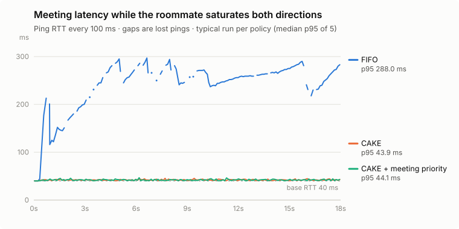

# RoomFlow

**Can my video call stay usable while my roommate uploads and downloads large files on the same connection?**

RoomFlow answers that with real packets: a Linux lab that shares one bottleneck between a "meeting" device and a "roommate" device, then compares three queueing policies under the same bandwidth.

[中文說明](docs/README.zh-TW.md)

## Finding

The problem is **bufferbloat**, and fair queuing fixes it almost completely. Prioritizing the meeting device on top of that made no measurable difference.

<picture>
  <source media="(prefers-color-scheme: dark)" srcset="docs/latency-dark.svg">
  
</picture>

Both directions congested (5 Mbps up / 20 Mbps down, 40 ms base RTT), five runs per policy on a native Linux kernel in CI ([workflow](.github/workflows/kernel-lab.yml), [raw results](results/native-ci/)):

| Policy | Meeting p95 RTT, mean (range) | Meeting loss up / down | Roommate throughput up / down |
|---|---:|---:|---:|
| FIFO (a plain router queue) | 288 ms (286–289) | 11.4% / 0.2% | 3.64 / 18.32 Mbps |
| CAKE SQM (fair queuing + AQM) | 43.9 ms (43.7–44.1) | 0% / 0% | 3.60 / 17.53 Mbps |
| CAKE + meeting priority | 44.2 ms (43.9–44.6) | 0% / 0% | 3.62 / 17.24 Mbps |

- **FIFO lets the bulk transfers fill the buffer**, so every meeting packet waits behind them: the 40 ms round trip becomes 288 ms at p95, and 11% of the meeting's upstream packets are lost.
- **CAKE keeps the queue short and shares the link fairly:** p95 is 4 ms above the base RTT with no meeting loss, and it costs the roommate about 4% of download throughput.
- **Meeting priority adds nothing:** 44.2 vs 43.9 ms, overlapping ranges, no loss either way. Once the queue is managed, there is no queue left to jump.

The same holds in each direction alone (upload: 232 ms FIFO vs 44 ms CAKE; download: 304 vs 41 ms), and with no background traffic all three policies sit at 40 ms. The full table is in each CI run's summary; an independent audit recomputes every number from the raw files, and the self-test checks that a roommate forging the Voice DSCP mark gets no priority.

**Why CI.** The first results came from a QEMU guest with software CPU emulation (TCG). Its timing was unreliable: later runs drifted, and even idle runs under CAKE showed loss. On a native kernel that noise disappeared: idle runs show no loss and every range is within a few milliseconds. The QEMU runs are kept for reference in [results/linux/](results/linux/REPORT.md) and the [first verification report](TEST_REPORT.md).

## How it works

```
meeting  10.77.1.2 ──┐               shared 5 Mbps up             netem, 20 ms each way
                     ├── router ─────────────────────── delay ─────────────────────── server
roommate 10.77.2.2 ──┘               shared 20 Mbps down
```

- **Topology:** five Linux network namespaces joined by veth pairs. Both users go through the same upload bottleneck (on the router's WAN side) and the same download bottleneck (on the far side, because Linux shapes traffic as it leaves an interface). The 40 ms round trip is added by netem on a separate link, so delay and queueing don't interfere. Offloads (GSO/GRO/TSO) are off so FIFO and CAKE see the same packets.
- **Policies:** FIFO is HTB with a plain FIFO queue (about 300 ms of buffer). SQM is CAKE in best-effort mode with per-host fairness. Meeting priority is CAKE diffserv4 with the meeting device classified into the Voice tin. Classification uses the device's source address and ingress interface, not the packet's DSCP mark, so a self-test checks that a roommate forging the Voice DSCP gets no priority. All three get the same bandwidth.
- **Traffic:** the meeting is a 600 Kbps UDP stream in each direction (a stand-in for call media) plus a timestamped ping; the roommate runs four TCP flows per direction with iperf3.
- **Measurement:** latency from the meeting's ping; loss, jitter, and throughput from iperf3's receiver-side reports; kernel qdisc and classifier counters before and after each run. 3-second warm-up, 15-second measurement, run order shuffled with a fixed seed, all raw files kept. An independent audit recomputes the summaries from the raw files.
- **Timed meeting mode:** `lab/session.py` applies priority for a set time, reads the kernel config back to confirm it, and a separate supervisor restores fair queuing when it expires, including after a restart.

The repository also has a browser dashboard and a Node.js queueing model for exploring the same question on Windows without a Linux kernel. The model is a simplified simulation, not CAKE; its numbers and the kernel lab's are not interchangeable.

## At home: is it actually bufferbloat?

The lab answers "if the problem is bufferbloat, which queue fixes it?". [`homenet/`](homenet/) answers the question that comes first, on the real home network: when a call stutters, is it the Wi-Fi, the router's queue under load, the ISP, or the far end?

- **`python -m homenet check`** reads the Wi-Fi link (band, channel, signal, RSSI, link rate), then measures latency bottom-up: the router, public IPs, DNS, and the services calls actually use (Zoom, Teams). The verdict names the lowest layer that is degraded, because a dead ISP also breaks DNS and every service, and those aren't the cause.
- **`python -m homenet bloat`** is the lab's experiment on the real link: latency at idle, then while parallel transfers to Cloudflare's speed-test endpoints saturate the download and then the upload. It samples TCP handshakes to 1.1.1.1 five times a second and pings the router once a second, so it can tell whether the queue builds locally (Wi-Fi, router) or upstream (modem, ISP), and grades the added latency.
- **`python -m homenet wifi`** scans nearby access points and shows how crowded your channel is. Wi-Fi radios take turns, so a neighbor on an overlapping channel takes airtime, not just adds noise. It groups 5 GHz channels into the 80 MHz blocks routers use, leaves out your own router's networks (matched by its hardware address in memory, never stored), reports the channel utilization access points advertise, and points to the quietest block, flagging DFS channels a router must leave when it detects radar.
- **`python -m homenet trace`** is MTR-style: it traces the route, pings every hop in parallel, and reports where along the path latency is added and whether any loss carries through. Routers answer pings addressed to themselves at low priority, so a single slow or lossy middle hop is usually not a problem; the tool only counts what persists to every later hop and the destination, and labels the rest.
- **`python -m homenet dns`** sends hand-built DNS queries (RFC 1035 wire format) straight to each resolver, the system's own and 1.1.1.1, 8.8.8.8 and 9.9.9.9, timing cached popular names and uncached random names that force a full lookup. Differences under 5 ms are reported as a tie.
- **`python -m homenet ipv6`** reaches the same services over IPv4 and IPv6. Apps prefer IPv6 when it works, so a slower IPv6 path quietly slows calls down.
- **`python -m homenet watch`** repeats `check` in a terminal; **`report`** summarizes everything recorded: latency by hour of day, each bufferbloat run, where the path adds latency across traces, and how often IPv6 is slower per service.
- **`scripts/schedule-homenet.ps1 install`** runs it all unattended with Windows Task Scheduler, for the current user and only while logged on: `check` every 5 minutes (skipped while a bufferbloat test is saturating the link), `path` (trace, then IPv4 vs IPv6) every 2 hours, and `bloat` three times a day. Runs have no console window and append to a log file one block at a time, so overlapping runs can't interleave. `uninstall` removes it.

History goes to a local SQLite file. Network names, MAC addresses and the router's address are never recorded; a test checks that.

## Run it

Kernel lab (an isolated Linux VM with root; Python standard library only):

```sh
sudo python3 lab/netlab.py check                 # verifies netns, HTB, CAKE, netem, flower support
sudo python3 lab/netlab.py setup
sudo python3 lab/netlab.py selftest --duration 8 --output results/linux/selftest
sudo python3 lab/netlab.py batch --duration 15 --repeats 3 --output results/linux/batch
sudo python3 lab/netlab.py teardown
```

Dashboard and model (Node.js 22+, no dependencies):

```sh
node src/server.mjs                # http://127.0.0.1:3210, English / 繁體中文
node --test tests/*.test.mjs       # 29 tests
python3 -m unittest discover -s lab -p "test_*.py"   # 18 lab tests
```

Details: [Linux lab guide](docs/linux-lab.md), [model definition](docs/simulator.md), [portable VM on Windows](docs/portable-vm.md).

## Limits

- Five 15-second runs per cell on one kind of CI runner: the differences that matter are far larger than the run-to-run spread, but this is not a statistical study across hardware.
- UDP at a fixed rate stands in for a call; there are no real codecs, adaptive bitrate, or Zoom/Teams quality scores.
- Everything runs in an isolated lab. Wi-Fi, a real home router, and ISP behavior are not tested.
